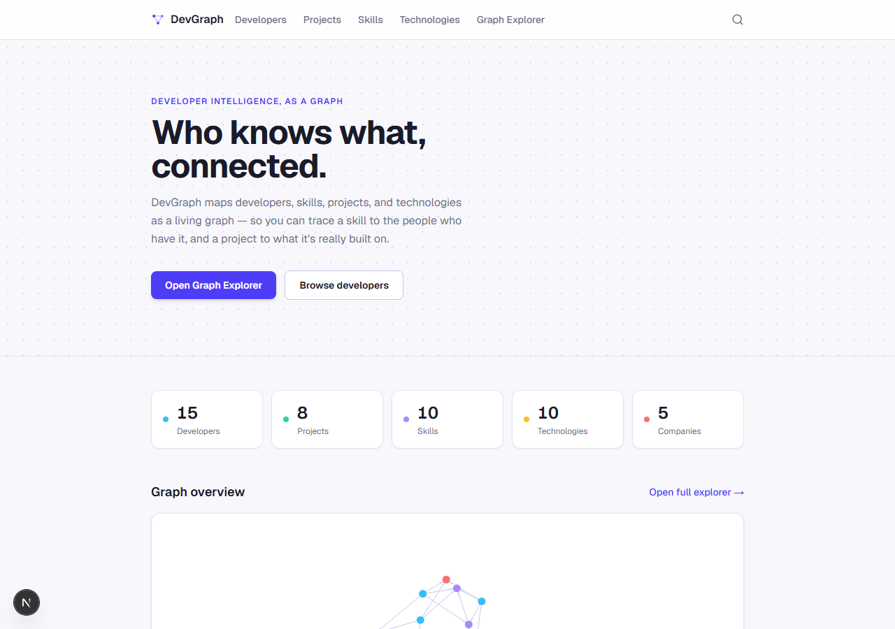
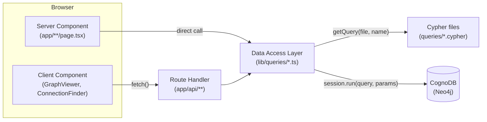
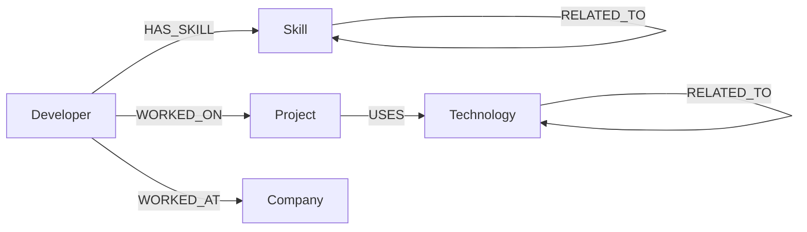
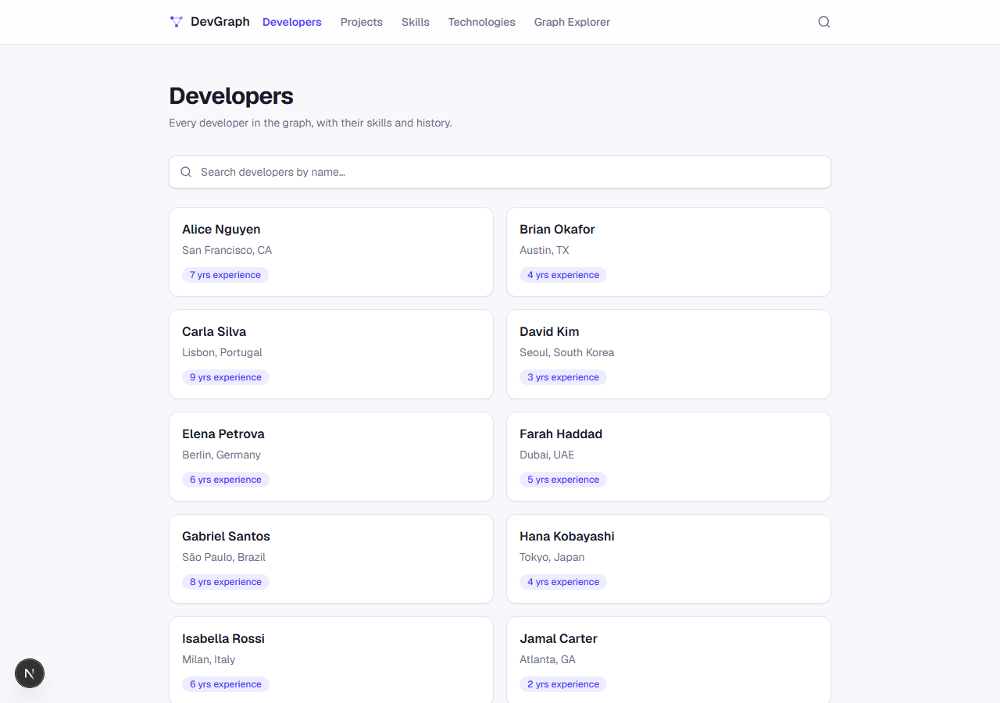
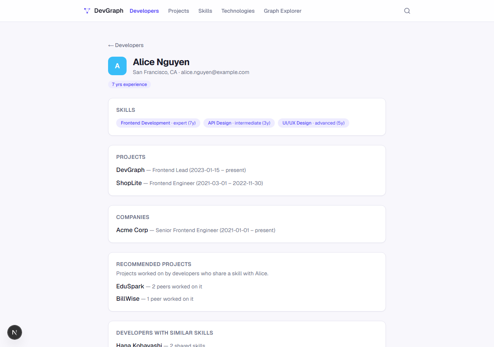
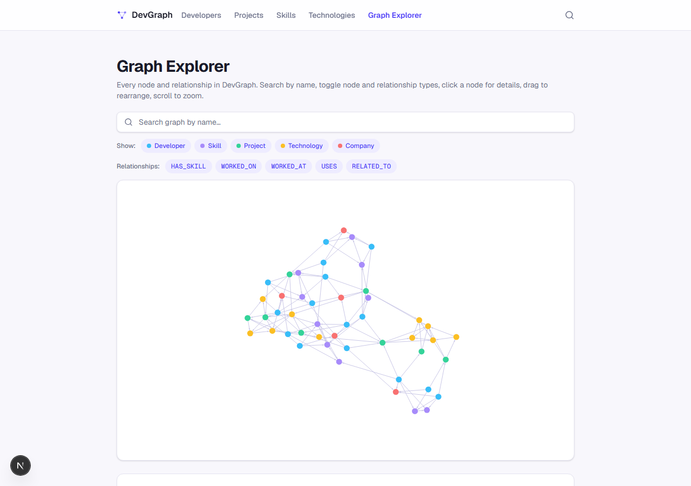
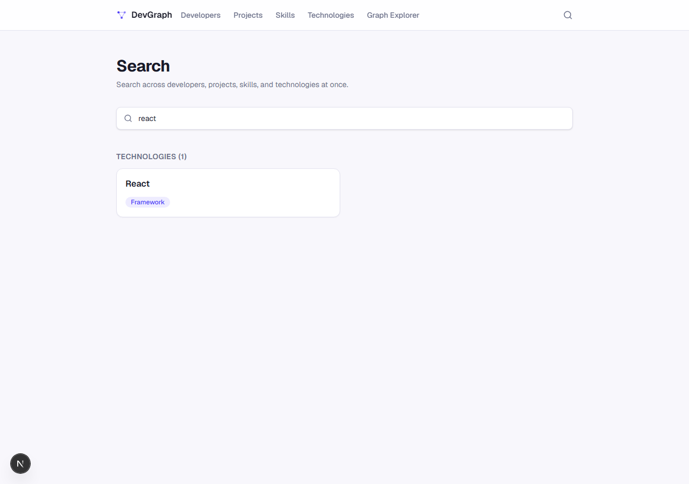

# DevGraph

A graph-powered developer intelligence platform. DevGraph models developers, skills,
projects, technologies, and companies as a connected graph in a Neo4j-compatible
CognoDB Cloud instance, and exposes it through a Next.js app: browse and search each
entity, see how they connect, get graph-native recommendations, and explore the whole
thing visually.



## Table of contents

- [Overview](#overview)
- [Use case](#use-case)
- [Why a graph database?](#why-a-graph-database)
- [Tech stack](#tech-stack)
- [Architecture](#architecture)
- [Graph data model](#graph-data-model)
- [Project structure](#project-structure)
- [Getting started](#getting-started)
- [Cypher queries](#cypher-queries)
- [Error handling](#error-handling)
- [Screenshots](#screenshots)
- [Live demo](#live-demo)
- [Screen recording](#screen-recording)
- [Future improvements](#future-improvements)

## Overview

DevGraph answers questions that are naturally shaped like graph traversals: *who has
this skill, who's worked with them, what did they build, and how are two people
connected at all?* Rather than modeling developers/skills/projects as rows in separate
tables joined by foreign keys, DevGraph stores them as nodes and relationships in a
graph database, so those questions become short, native Cypher traversals instead of
chains of joins.

The app itself is a standard Next.js App Router site: server-rendered list and detail
pages for each entity, a handful of JSON API routes, and an interactive force-directed
graph explorer with search, filtering, and shortest-path finding between developers.

## Use case

Picture an engineering org that wants to answer, without spelunking through wikis or
spreadsheets:

- *"Who on the team knows GraphQL, and how deep is their experience?"* → [Developers
  by skill](#cypher-queries)
- *"What is DevGraph built with, and what should we consider next given what we
  already use?"* → related-technology recommendations
- *"If I need a Neo4j expert, who's most likely to give a good referral based on who
  they've worked with?"* → the shortest-connection finder in the Graph Explorer
- *"New hire — who else on the team has a similar skill profile, and what have their
  peers built that might interest them?"* → similar-developer and peer-recommended-project
  queries

None of this requires a dedicated analyst — it's just traversal, and traversal is what
a graph database is for.

## Why a graph database?

The relationships *are* the data here, not an afterthought bolted onto rows. A
developer's value to a team question is rarely "what's in their one row" — it's how
they connect to skills, projects, and other people, often several hops away. Three
concrete reasons this app is graph-native rather than relational:

1. **Queries are shaped like the questions.** "Developers who share a skill with
   peers who worked on a given project" is a 3-hop pattern match in Cypher
   (`(dev)-[:HAS_SKILL]->(:Skill)<-[:HAS_SKILL]-(peer)-[:WORKED_ON]->(project)`) — see
   [`peerRecommendedProjects`](#cypher-queries). The relational version needs three
   joins across as many junction tables, and the join plan only gets worse as the
   question adds another hop.
2. **Variable-length and shortest-path traversal is native, not bolted on.** The
   connection finder in the Graph Explorer finds the shortest path between two
   developers through *any* relationship type — skills, projects, companies — with no
   fixed path length decided in advance. In Cypher that's one line:
   `MATCH path = shortestPath((from)-[*..6]-(to))`. See the [relational
   comparison](#multi-hop--variable-length-traversal) below for what the same query
   looks like in SQL.
3. **The schema grows the way the questions do.** Adding "technologies relate to each
   other" (`Technology-[:RELATED_TO]->Technology`) didn't require touching any
   existing table — it's just a new relationship type layered onto the same nodes.

## Tech stack

| Layer | Choice |
| --- | --- |
| Framework | [Next.js 16](https://nextjs.org) (App Router, Turbopack) |
| UI | React 19, TypeScript, Tailwind CSS v4 |
| Database | CognoDB Cloud (Neo4j-compatible), accessed via the official [`neo4j-driver`](https://www.npmjs.com/package/neo4j-driver) |
| Query language | Cypher, stored as `.cypher` files, always parameterized |
| Graph visualization | [`react-force-graph-2d`](https://github.com/vasturiano/react-force-graph) (canvas-based force-directed layout) |
| Scripting | [`tsx`](https://github.com/privatenumber/tsx) for the standalone seed script |

## Architecture

Two things reach CognoDB, and they get there differently:

- **Server Components** (every list/detail page) call the data access layer
  (`lib/queries/*.ts`) directly, in-process — no network hop.
- **Client Components** (`GraphViewer`, `ConnectionFinder`) run in the browser and
  can't hold driver credentials, so they `fetch()` a Route Handler under `app/api/`,
  which calls the same data access layer.

Both paths converge on the same parameterized `session.run(query, params)` call — the
only thing that differs is how many hops the request takes to get there.



A standalone script (`scripts/seed.ts`) reaches the same `lib/cognodb.ts` driver
outside of Next's bundler entirely, to populate the database — see
[Seed the database](#4-seed-the-database).

## Graph data model

**Nodes:** `Developer`, `Skill`, `Project`, `Technology`, `Company`

**Relationships:**



Relationship properties carry the context a plain edge can't:

| Relationship | Properties |
| --- | --- |
| `HAS_SKILL` | `proficiency`, `yearsOfExperience` |
| `WORKED_ON` | `role`, `startDate`, `endDate` |
| `WORKED_AT` | `role`, `startDate`, `endDate` |
| `USES` | `usage` (`primary` \| `secondary`) |
| `RELATED_TO` (Skill↔Skill, Technology↔Technology) | `strength` (0–1) |

Node/relationship TypeScript types and Cypher constraints live in `lib/graph/types.ts`
and `lib/graph/constraints.ts` — every node label has a uniqueness constraint on `id`
plus a range index on `name`.

## Project structure

```
app/                  Routes (App Router)
  developers/                          List + detail pages
  projects/                            List + detail pages
  skills/                              List + detail pages
  technologies/                        List + detail pages
  search/                              Cross-entity search page
  graph/                               Graph Explorer page
  api/
    developers/                        GET /api/developers?q=
    developers/[id]/                   GET /api/developers/:id
    developers/[id]/recommendations/   GET /api/developers/:id/recommendations
    projects/                          GET /api/projects?q=
    projects/[id]/                     GET /api/projects/:id
    projects/[id]/recommendations/     GET /api/projects/:id/recommendations
    skills/                            GET /api/skills?q=
    technologies/                      GET /api/technologies?q=
    search/                            GET /api/search?q= — cross-entity search
    graph/                             GET /api/graph — full graph as {nodes, links}
    graph/connection/                  GET /api/graph/connection?from=&to= — shortest path
    health/db/                         GET /api/health/db — CognoDB connectivity check
  error.tsx, not-found.tsx             Global error/404 boundaries

components/            UI components
  DeveloperCard.tsx, ProjectCard.tsx, SkillCard.tsx, TechnologyCard.tsx
  EntityAvatar.tsx, DetailSection.tsx   Shared detail-page layout pieces
  SearchBar.tsx                        Client component, syncs to the `?q=` URL param
  GraphViewer.tsx                      Client component: force-directed graph, search,
                                        filters, click-for-details
  ConnectionFinder.tsx                 Client component: shortest-path finder
  SiteHeader.tsx, NavLink.tsx          Navigation

lib/
  cognodb.ts             Shared Neo4j driver (server-only, singleton)
  validation.ts           Shared input-validation helpers for API routes
  graph/                  Node/relationship TypeScript types, constraints, seed data
  queries/                 Data access layer — one module per entity, backed by queries/*.cypher

queries/                Raw parameterized Cypher, grouped by concern
  developers.cypher, projects.cypher, recommendations.cypher

scripts/
  seed.ts                 Seed entrypoint (`npm run db:seed`)
  server-only-shim.ts      Lets seed.ts run cognodb.ts outside the Next.js bundler

docs/screenshots/       Images used in this README
```

## Getting started

### 1. CognoDB setup

You need a CognoDB Cloud instance (Neo4j-compatible) reachable over Bolt. From its
dashboard, collect three values: the connection URI (starts with `bolt+s://` or
`neo4j+s://`), a username, and a password.

### 2. Environment setup

Copy the example file and fill in what you collected above:

```bash
cp .env.example .env.local
```

```
COGNODB_URI=bolt+s://your-instance.databases.cognodb.com
COGNODB_USERNAME=your-username
COGNODB_PASSWORD=your-password
```

`.env.local` (and `.env`) are gitignored — never commit real credentials.
`.env.example` is intentionally the one exception, kept in the repo with empty values
as a template.

### 3. Installation

```bash
npm install
```

### 4. Seed the database

```bash
npm run db:seed
```

This applies constraints/indexes and populates 15 developers, 10 skills, 8 projects,
10 technologies, and 5 companies with realistic relationships between them. It's
idempotent — every write is `MERGE`d on `id`, so re-running it updates properties
instead of duplicating data. Safe to run again any time, including in CI.

### 5. Run the app

```bash
npm run dev
```

Open [http://localhost:3000](http://localhost:3000).

For a production build:

```bash
npm run build
npm start
```

## Cypher queries

Every query lives in `queries/*.cypher` as a named block, loaded and parsed by
`lib/queries/loadCypherFile.ts`, and run parameterized — never string-built — from the
matching `lib/queries/*.ts` module.

| Query | File | Traversal | DAL function |
| --- | --- | --- | --- |
| `listDevelopers` / `getDeveloperById` | `developers.cypher` | 0–1 hop | `listDevelopers`, `getDeveloperById` |
| `findDevelopersBySkill` | `developers.cypher` | 1-hop | `findDevelopersBySkill(skillName)` |
| `listProjects` / `getProjectById` | `projects.cypher` | 0–1 hop | `listProjects`, `getProjectById` |
| `findProjectsByTechnology` | `projects.cypher` | 1-hop | `findProjectsByTechnology(technologyName)` |
| `findDevelopersForProject` | `projects.cypher` | 1-hop | `findDevelopersForProject(projectId)` |
| `listSkills` / `getSkillById` | `recommendations.cypher` | 0–1 hop | `listSkills`, `getSkillById` |
| `listTechnologies` / `getTechnologyById` | `recommendations.cypher` | 0–1 hop | `listTechnologies`, `getTechnologyById` |
| `relatedTechnologiesForProject` | `recommendations.cypher` | 2-hop | `getRelatedTechnologiesForProject(projectId)` |
| `similarDevelopers` | `recommendations.cypher` | 2-hop | `getSimilarDevelopers(developerId)` |
| `peerRecommendedProjects` | `recommendations.cypher` | 3-hop | `getPeerRecommendedProjects(developerId)` |
| `developerConnectionPath` ⭐ | `recommendations.cypher` | variable-length | `getDeveloperConnectionPath(fromId, toId)` |
| `fullGraph` | `recommendations.cypher` | 1-hop, all nodes | `getFullGraph()` |
| `graphStats` | `recommendations.cypher` | aggregate | `getGraphStats()` |

### Multi-hop / variable-length traversal

**2-hop** — `similarDevelopers`: developers who share a skill with a given developer.

```cypher
MATCH (target:Developer {id: $developerId})-[:HAS_SKILL]->(skill:Skill)<-[:HAS_SKILL]-(other:Developer)
WHERE other.id <> target.id
WITH other, count(DISTINCT skill) AS sharedSkills
RETURN other AS developer, sharedSkills
ORDER BY sharedSkills DESC
```

**3-hop** — `peerRecommendedProjects`: projects worked on by developers who share a
skill with the target developer.

```cypher
MATCH (target:Developer {id: $developerId})-[:HAS_SKILL]->(:Skill)<-[:HAS_SKILL]-(peer:Developer)-[:WORKED_ON]->(project:Project)
WHERE NOT project.id IN existingProjectIds
WITH project, count(DISTINCT peer) AS peerCount
RETURN project, peerCount
ORDER BY peerCount DESC
```

**⭐ Variable-length shortest path** — `developerConnectionPath`: the shortest path
between two developers through *any* relationship type, with no fixed length decided
up front.

```cypher
MATCH (from:Developer {id: $fromDeveloperId}), (to:Developer {id: $toDeveloperId})
MATCH path = shortestPath((from)-[*..6]-(to))
RETURN
  [node IN nodes(path) | {label: labels(node)[0], id: node.id, name: node.name}] AS pathNodes,
  [rel IN relationships(path) | type(rel)] AS relationshipTypes,
  length(path) AS hops
```

### Relational comparison

Take that last query — shortest path between two people through *any* kind of
connection. The relational equivalent needs a recursive CTE, because the number of
joins isn't known ahead of time:

```sql
WITH RECURSIVE path(current_id, target_id, depth, visited, found) AS (
  SELECT d1.id, d2.id, 0, ARRAY[d1.id], (d1.id = d2.id)
  FROM developers d1, developers d2
  WHERE d1.id = :from_id AND d2.id = :to_id

  UNION ALL

  -- Repeat once per relationship *type* you want to traverse: HAS_SKILL, then
  -- back out through developer_skills, then WORKED_ON, then WORKED_AT, then
  -- back through skill_relationships and technology_relationships — each needs
  -- its own join against a different junction table, unioned together.
  SELECT next_id, p.target_id, p.depth + 1, p.visited || next_id, (next_id = p.target_id)
  FROM path p
  JOIN developer_skills ds ON ds.developer_id = p.current_id
  JOIN developer_skills ds2 ON ds2.skill_id = ds.skill_id
  -- ...repeated per relationship type, with NOT (next_id = ANY(p.visited))
  -- for cycle detection, and a depth cap so it terminates...
  WHERE p.depth < 6 AND NOT p.found
)
SELECT * FROM path WHERE found ORDER BY depth LIMIT 1;
```

That's before handling cycles correctly across a mixed-type path, guaranteeing
*shortest* (not just *a*) path, or keeping it performant as the schema grows another
relationship type. In Cypher it's the four lines above. This is the single clearest
example in this app of a query that's natural in a graph database and genuinely
awkward relationally — see `queries/recommendations.cypher` for the full comment.

## Error handling

- **API routes** — every route wraps its query in try/catch: the real error is logged
  server-side via `console.error`, and the client always gets a fixed generic message
  (never `error.message` or the raw error object). Missing/invalid required input
  (search terms, `from`/`to` ids) returns `400`; a valid but nonexistent id returns
  `404`; a database failure returns `503`. Verified directly with a real bad-password
  connection attempt — the raw driver error contains neither username nor password.
- **UI** — `app/error.tsx` is a React error boundary that catches any uncaught
  exception from a Server Component (including a CognoDB outage) and renders a
  friendly "Something went wrong" screen with a retry button, instead of a raw crash.
  `app/not-found.tsx` covers missing developers/projects/skills/technologies (real
  `404` status, not a soft-404 — see the note on `loading.tsx` + `notFound()`
  interaction in the code comments if you touch that area).
- **Loading states** — page-local `<Suspense>` boundaries around each list page's
  results show a skeleton grid while the query is in flight, without blocking the
  header/search bar from being interactive.

## Screenshots

**Dashboard** — live stat tiles and a graph preview:


**Developers** — searchable list:



**Developer detail** — skills, projects, companies, and graph-native recommendations:



**Graph Explorer** — force-directed layout with search, node/relationship filters, and
a shortest-path connection finder:



**Search** — cross-entity results grouped by type:



## Live demo

Not currently deployed. Run it locally with the steps in [Getting
started](#getting-started) — once you have a CognoDB instance and `.env.local` filled
in, `npm run dev` is all you need.

## Screen recording

None recorded yet.

## Future improvements

- **Company entity pages** — companies exist in the graph and appear in the
  developer/Graph Explorer views, but have no dedicated list/detail pages the way the
  other four node types do.
- **Pagination** — list endpoints return every matching row; fine at this dataset
  size, but would need `SKIP`/`LIMIT` and cursor-based pagination at real scale.
- **Auth** — there's currently no authentication/authorization layer; every route is
  public. A real deployment would need at least read/write separation.
- **Write paths** — the app is read-only end-to-end (seeding aside). Adding a
  developer, logging a new skill, or editing a project all require going through the
  seed script or a Cypher console directly.
- **Caching** — every page hits CognoDB fresh on every request (`export const dynamic
  = "force-dynamic"` on the pages that need live data). A real deployment would want
  `use cache`/revalidation on data that doesn't change every second, like the
  Dashboard stats.
- **Tests** — verification so far has been manual (live queries, curl, Playwright
  screenshots run during development) rather than an automated suite that runs in CI.
- **Company-aware recommendations** — `similarDevelopers` and
  `peerRecommendedProjects` only consider skills; factoring in shared companies or
  technology overlap would sharpen the recommendations.
